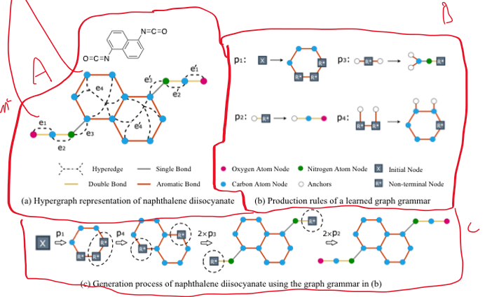

# Mini-DEG

Mini implementation and experiments for ["Data-Efficient Graph Grammar Learning for Molecular Generation"](https://github.com/gmh14/data_efficient_grammar)

Neo4j (idea to store generalized prod rules similar to AlphaFold MSA)

